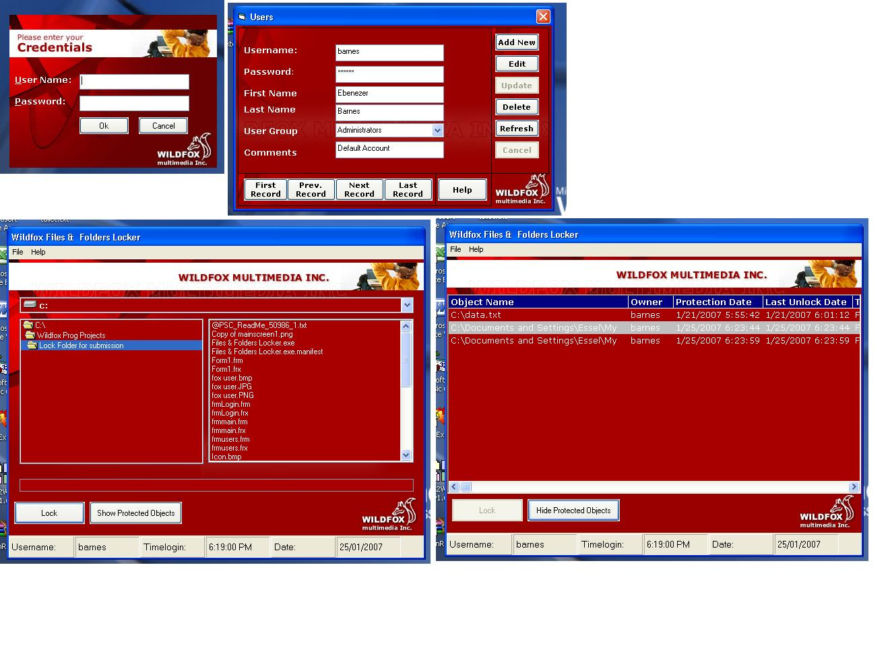



## Wildfox Files &amp; Folders Locker

### Description

The purpose of this program is to protect your files and folders from prying eyes. You can lock individual files or complete folders.

Features include:

1. Stealth startup? (curtesy Dr. Y mosibatzadeh@yahoo.com)

2. Multi-user environment

3. view protected objects per user basis

4. Tempering proof? (program shuts down automatically on files modification or deletion).

etc.
 
### More Info
 
Has not been tested on 9x systems

             |
---                |---
**Submitted On**   |2007-01-21 18:00:00
**By**             |[Ebenezer Barnes](https://github.com/Planet-Source-Code/PSCIndex/blob/master/ByAuthor/ebenezer-barnes.md)
**Level**          |Intermediate
**User Rating**    |3.7 (11 globes from 3 users)
**Compatibility**  |VB 6\.0
**Category**       |[Complete Applications](https://github.com/Planet-Source-Code/PSCIndex/blob/master/ByCategory/complete-applications__1-27.md)
**World**          |[Visual Basic](https://github.com/Planet-Source-Code/PSCIndex/blob/master/ByWorld/visual-basic.md)
**Archive File**   |[Wildfox\_Fi2044741252007\.zip](https://github.com/Planet-Source-Code/ebenezer-barnes-wildfox-files-amp-folders-locker__1-67734/archive/master.zip)

